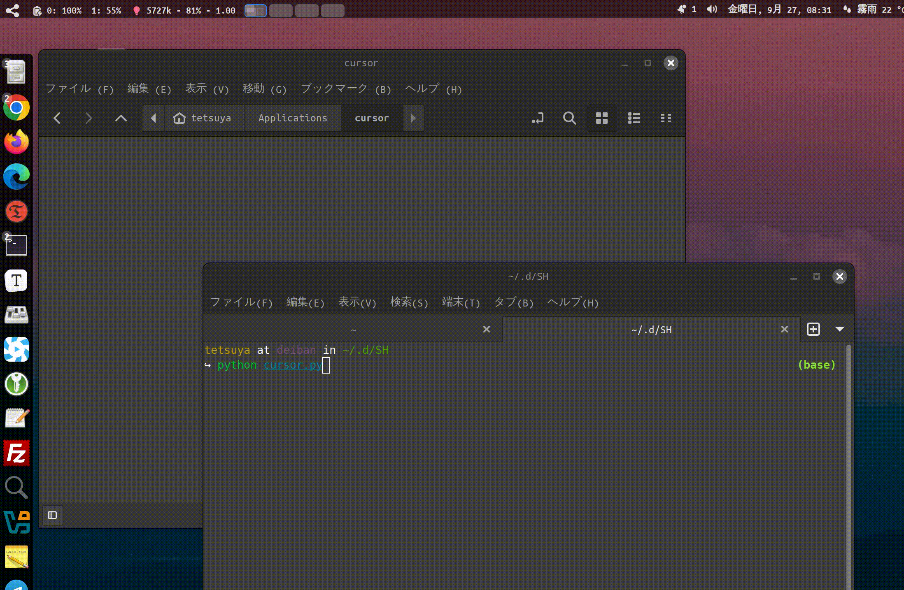

# Cursor Installation and  UpdateScript
Cursor インストールスクリプトと更新



## 機能概要

このPythonスクリプトは、LinuxシステムでCursorエディタを自動的にダウンロード、更新、インストールするために使用されます。

## Feature Overview

This Python script is used to automatically download, update, and install the Cursor editor on Linux systems.

主な機能は以下の通りです：

- Cursorの最新バージョンをチェックしてダウンロード
- インストールディレクトリとファイルの管理
- 必要なショートカットとデスクトップ統合の作成

The main features are as follows:

- Check and download the latest version of Cursor
- Manage installation directories and files
- Create necessary shortcuts and desktop integration

## 使用方法

システムにPython 3がインストールされていることを確認してください。

## Usage

Make sure Python 3 is installed on your system.

スクリプトをローカルファイルに保存します（例：cursor_updater.py）。

Save the script to a local file (e.g., cursor_updater.py).

ターミナルでスクリプトを実行します：

Run the script in the terminal:

 ```python
 python3 cursor_updater.py
 ```

インストールされていない場合は自動的にインストールされ、既にインストールされている場合は更新をチェックし、新しいバージョンが利用可能な場合はダウンロードしてインストールします。

If not installed, it will automatically install, and if already installed, it will check for updates and download and install if a new version is available.

スクリプトは指定されたディレクトリにファイルを保存し、適切な権限を設定し、対応するアイコンをダウンロードし、システムのアプリケーションメニューにCursorを表示するためのショートカットを作成します。

The script saves files to the specified directory, sets appropriate permissions, downloads corresponding icons, and creates shortcuts to display Cursor in the system's application menu.

## 注意事項

スクリプトは更新のチェックとファイルのダウンロードのためにインターネット接続が必要です。

## Notes

The script requires an internet connection to check for updates and download files.

インストールディレクトリはデフォルトで~/Applications/cursorに設定されています。

The installation directory is set to ~/Applications/cursor by default.

スクリプトは権限とデスクトップ統合を自動的に処理するため、追加の操作は必要ありません。

The script automatically handles permissions and desktop integration, so no additional operations are required.

## エラー処理

スクリプトには基本的なエラー処理メカニズムが含まれており、ダウンロードまたはインストール中に問題が発生した場合、対応するエラーメッセージが表示されます。

## Error Handling

The script includes basic error handling mechanisms, and if problems occur during download or installation, corresponding error messages will be displayed.

# Licence

GNU AFFERO GENERAL PUBLIC LICENSE Version 3

Copyright (c) cheyan ([http://iamcheyan.com](http://iamcheyan.com/))